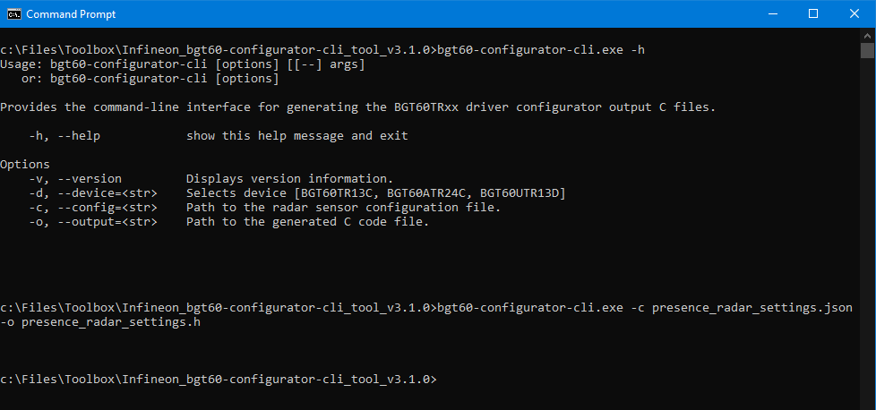
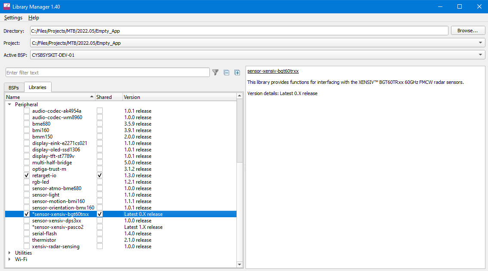

# XENSIV™ BGT60TRxx Radar Sensor

This library provides functions for interfacing with the XENSIV™ BGT60TRxx 60 GHz FMCW Radar Sensors. This library can be set up to use the ModusToolbox&trade; HAL interface, or using user-provided communication functions. For more information about the XENSIV™ Radar Sensor please visit the [Infineon web page on radar sensors](https://www.infineon.com/cms/en/product/sensor/radar-sensors/radar-sensors-for-iot/60ghz-radar/).

The BGT60TR13C Datasheet is available as part of **Radar Development Kit** which can be obtained through the [Infineon Developer Center](https://softwaretools.infineon.com/welcome). 

Once the **Radar Development Kit** is installed using the Infineon Developer Center follow the next steps to locate the BGT60TR13C Datasheet:
1. Start the **Radar Development Kit** using Infineon Developer Center. 
2. Scroll down to **Packages** section. Download the **Documentation** package. 
3. Unzip the file **RDK-Package.zip** and open the BGT60TR13C Datasheet V2.4.6 document.


## Quick start

For the hardware setup, see the [Radar development kit user guide](https://www.infineon.com/cms/en/product/evaluation-boards/kit_csk_bgt60tr13c/).

The initialization of the XENSIV™ BGT60TRxx radar sensor requires a list of registers that can be generated using the bgt60-configurator-cli tool.

The bgt60-configurator-cli is available part of **Radar Development Kit** which can be obtained through the [Infineon Developer Center](https://softwaretools.infineon.com/welcome). 

Once the **Radar Development Kit** is installed using the Infineon Developer Center follow the next steps to locate the bgt60-configurator-cli tool:
1. Start the **Radar Development Kit** using Infineon Developer Center. 
2. Scroll down to **Packages** section. Download the **Software** package. 
3. Unzip the file **RDK-TOOLS-SW.zip** and browse into *Tools* folder.

The bgt60-configurator-cli tool takes as input a configuration file in JSON format specifying the radar parameters:

    {
        "device_config": {
            "fmcw_single_shape": {
                "rx_antennas": [1], 
                "tx_antennas": [1], 
                "tx_power_level": 31, 
                "if_gain_dB": 60, 
                "lower_frequency_Hz": 61020098000, 
                "upper_frequency_Hz": 61479902000, 
                "num_chirps_per_frame": 1, 
                "num_samples_per_chirp": 128, 
                "chirp_repetition_time_s": 7e-05, 
                "frame_repetition_time_s": 5e-3, 
                "sample_rate_Hz": 2330000
            }
        }
    }

**Note:** For the functionality of the following example, ADC channel 1 must be active because the data test mode works only on this channel. See the `rx_antennas` item in the configuration file.

Save the configuration as presence_radar_settings.json. 

To generate the register file run in a command line window:

```
./bgt60-configurator-cli -c presence_radar_settings.json -o presence_radar_settings.h
```
   **Figure 1. bgt60-configurator-cli tool**

   


Follow the steps below to create a simple application that checks basic functionality and connectivity to the radar sensor. The application configures the sensor according to the user defined configuration, enables the sensor test pattern generator on chip for data transfer check, starts the frame generation and compares the obtained data from the radar sensor on antenna RX1 against the defined bit sequence defined by the sensor test pattern generator.

1. Create an empty ModusToolbox application for your board, e.g. CYSBSYSKIT-DEV-01.

2. Add this library, i.e. sensor-xensiv-bgt60trxx, to the application using the Library Manager. 

   **Figure 2. Library Manager**

   

3. Add the retarget-io library using the Library Manager.

4. Define the following as as appropriate for your hardware/kit configuration:

   - `PIN_XENSIV_BGT60TRXX_SPI_SCLK`
   - `PIN_XENSIV_BGT60TRXX_SPI_MOSI`
   - `PIN_XENSIV_BGT60TRXX_SPI_MISO`
   - `PIN_XENSIV_BGT60TRXX_SPI_CSN`
   - `PIN_XENSIV_BGT60TRXX_IRQ`
   - `PIN_XENSIV_BGT60TRXX_RSTN`
   - `PIN_XENSIV_BGT60TRXX_LDO_EN`

    **Note:** The pins in the code example below correspond to the ones used in [CYBSYSKIT-DEV-01](https://github.com/Infineon/TARGET_CYSBSYSKIT-DEV-01) kit 

5. Place the following code in the *main.c* file.

```cpp
#include <inttypes.h>

#include "cyhal.h"
#include "cybsp.h"

#include "cy_retarget_io.h"
#include "xensiv_bgt60trxx_mtb.h"

#define XENSIV_BGT60TRXX_CONF_IMPL
#include "presence_radar_settings.h"

/*******************************************************************************
* Macros
*******************************************************************************/
/* sensor SPI interface */
#define PIN_XENSIV_BGT60TRXX_SPI_SCLK       CYBSP_SPI_CLK
#define PIN_XENSIV_BGT60TRXX_SPI_MOSI       CYBSP_SPI_MOSI
#define PIN_XENSIV_BGT60TRXX_SPI_MISO       CYBSP_SPI_MISO
#define PIN_XENSIV_BGT60TRXX_SPI_CSN        CYBSP_SPI_CS

/* sensor interrupt output pin */
#define PIN_XENSIV_BGT60TRXX_IRQ            CYBSP_GPIO10
/* sensor HW reset pin */
#define PIN_XENSIV_BGT60TRXX_RSTN           CYBSP_GPIO11
/* enable 1V8 LDO on radar wingboard*/
#define PIN_XENSIV_BGT60TRXX_LDO_EN         CYBSP_GPIO5

#define XENSIV_BGT60TRXX_SPI_FREQUENCY      (25000000UL)

#define NUM_SAMPLES_PER_FRAME               (XENSIV_BGT60TRXX_CONF_NUM_RX_ANTENNAS *\
                                             XENSIV_BGT60TRXX_CONF_NUM_CHIRPS_PER_FRAME *\
                                             XENSIV_BGT60TRXX_CONF_NUM_SAMPLES_PER_CHIRP)

/*******************************************************************************
* Global variables
*******************************************************************************/
static cyhal_spi_t cyhal_spi;
static xensiv_bgt60trxx_mtb_t sensor;
static volatile bool data_available = false;

/* Allocate enough memory for the radar dara frame. */
static uint16_t samples[NUM_SAMPLES_PER_FRAME];

/* Interrupt handler to react on sensor indicating the availability of new data */
#if defined(CYHAL_API_VERSION) && (CYHAL_API_VERSION >= 2)
void xensiv_bgt60trxx_mtb_interrupt_handler(void *args, cyhal_gpio_event_t event)
#else
void xensiv_bgt60trxx_mtb_interrupt_handler(void *args, cyhal_gpio_irq_event_t event)
#endif
{
    CY_UNUSED_PARAMETER(args);
    CY_UNUSED_PARAMETER(event);
    data_available = true;
}

int main(void)
{
    cy_rslt_t result = CY_RSLT_SUCCESS;

    /* Initialize the device and board peripherals. */
    result = cybsp_init();
    CY_ASSERT(result == CY_RSLT_SUCCESS);

    __enable_irq();

    /* Initialize retarget-io to use the debug UART port. */
    result = cy_retarget_io_init(CYBSP_DEBUG_UART_TX, CYBSP_DEBUG_UART_RX, CY_RETARGET_IO_BAUDRATE);
    CY_ASSERT(result == CY_RSLT_SUCCESS);

    printf("XENSIV BGT60TRxx Example\r\n");

    /* Initialize the SPI interface to BGT60. */
    result = cyhal_spi_init(&cyhal_spi,
                            PIN_XENSIV_BGT60TRXX_SPI_MOSI,
                            PIN_XENSIV_BGT60TRXX_SPI_MISO,
                            PIN_XENSIV_BGT60TRXX_SPI_SCLK,
                            NC,
                            NULL,
                            8,
                            CYHAL_SPI_MODE_00_MSB,
                            false);
    CY_ASSERT(result == CY_RSLT_SUCCESS);

    /* Reduce drive strength to improve EMI */
    Cy_GPIO_SetSlewRate(CYHAL_GET_PORTADDR(PIN_XENSIV_BGT60TRXX_SPI_MOSI),
                        CYHAL_GET_PIN(PIN_XENSIV_BGT60TRXX_SPI_MOSI), CY_GPIO_SLEW_FAST);
    Cy_GPIO_SetDriveSel(CYHAL_GET_PORTADDR(PIN_XENSIV_BGT60TRXX_SPI_MOSI),
                        CYHAL_GET_PIN(PIN_XENSIV_BGT60TRXX_SPI_MOSI), CY_GPIO_DRIVE_1_8);
    Cy_GPIO_SetSlewRate(CYHAL_GET_PORTADDR(PIN_XENSIV_BGT60TRXX_SPI_SCLK),
                        CYHAL_GET_PIN(PIN_XENSIV_BGT60TRXX_SPI_SCLK), CY_GPIO_SLEW_FAST);
    Cy_GPIO_SetDriveSel(CYHAL_GET_PORTADDR(PIN_XENSIV_BGT60TRXX_SPI_SCLK),
                        CYHAL_GET_PIN(PIN_XENSIV_BGT60TRXX_SPI_SCLK), CY_GPIO_DRIVE_1_8);

    /* Set SPI data rate to communicate with sensor */
    result = cyhal_spi_set_frequency(&cyhal_spi, XENSIV_BGT60TRXX_SPI_FREQUENCY);
    CY_ASSERT(result == CY_RSLT_SUCCESS);

    /* Enable the LDO. */
    result = cyhal_gpio_init(PIN_XENSIV_BGT60TRXX_LDO_EN,
                             CYHAL_GPIO_DIR_OUTPUT,
                             CYHAL_GPIO_DRIVE_STRONG,
                             true);
    CY_ASSERT(result == CY_RSLT_SUCCESS);

    /* Wait LDO stable */
    (void)cyhal_system_delay_ms(5);

    result = xensiv_bgt60trxx_mtb_init(&sensor,
                                       &cyhal_spi,
                                       PIN_XENSIV_BGT60TRXX_SPI_CSN,
                                       PIN_XENSIV_BGT60TRXX_RSTN,
                                       register_list,
                                       XENSIV_BGT60TRXX_CONF_NUM_REGS);
    CY_ASSERT(result == CY_RSLT_SUCCESS);

    /* The sensor will generate an interrupt once the sensor FIFO level is
       NUM_SAMPLES_PER_FRAME */
    result = xensiv_bgt60trxx_mtb_interrupt_init(&sensor,
                                                 NUM_SAMPLES_PER_FRAME,
                                                 PIN_XENSIV_BGT60TRXX_IRQ,
                                                 CYHAL_ISR_PRIORITY_DEFAULT,
                                                 xensiv_bgt60trxx_mtb_interrupt_handler,
                                                 NULL);
    CY_ASSERT(result == CY_RSLT_SUCCESS);

    /* Enable sensor data test mode. The data received on antenna RX1 will be overwritten by 
       a deterministic sequence of data generated by the test pattern generator */
    if (xensiv_bgt60trxx_enable_data_test_mode(&sensor.dev, true) != XENSIV_BGT60TRXX_STATUS_OK)
    {
        CY_ASSERT(0);
    }

    if (xensiv_bgt60trxx_start_frame(&sensor.dev, true) != XENSIV_BGT60TRXX_STATUS_OK)
    {
        CY_ASSERT(0);
    }

    uint32_t frame_idx = 0;
    uint16_t test_word = XENSIV_BGT60TRXX_INITIAL_TEST_WORD;

    for(;;)
    {
        /* Wait for the radar device to indicate the availability of the data to fetch. */
        while (data_available == false);
        data_available = false;

        if (xensiv_bgt60trxx_get_fifo_data(&sensor.dev, samples,
                                           NUM_SAMPLES_PER_FRAME) == XENSIV_BGT60TRXX_STATUS_OK)
        {
            /* Check received data */
            for (int32_t sample_idx = 0; sample_idx < NUM_SAMPLES_PER_FRAME; ++sample_idx)
            {
                    if (test_word != samples[sample_idx])
                    {
                        printf("Frame %" PRIu32 " error detected. "
                               "Expected: %" PRIu16 ". "
                               "Received: %" PRIu16 "\n",
                               frame_idx, test_word, samples[sample_idx]);
                        CY_ASSERT(0);
                    }

                    // Generate next test_word
                    test_word = xensiv_bgt60trxx_get_next_test_word(test_word);
            }
        }

        printf("Frame %" PRIu32 " received correctly\n", frame_idx);
        frame_idx++;
    }
}

```
6. Connect the board to your PC using the provided USB cable through the KitProg3 USB connector.

7. Open a terminal program and select the KitProg3 COM port. Set the serial port parameters to 8N1 and 115200 baud.

8. Build the application and program the kit. After programming, the application starts automatically.

   **Figure 3. Terminal output on program startup**

   


## Using the library for your own platform

The library can be used in your own platform copying the following files to your project:
- *xensiv_bgt60trxx.c*
- *xensiv_bgt60trxx.h*
- *xensiv_bgt60trxx_platform.h*
- *xensiv_bgt60trxx_regs.h*

The library depends on platform-specific implementation of functions declared in *xensiv_bgt60trxx_platform.h*:

```cpp
/* Platform-specific function that sets the output value of the RST pin. */
void xensiv_bgt60trxx_platform_rst_set(const void* iface, bool val);

/* Platform-specific function that that sets the output value of the SPI CS pin. */
void xensiv_bgt60trxx_platform_spi_cs_set(const void* iface, bool val);

/* Platform-specific function that performs a SPI write/read transfer to
 * the register file of the sensor. */
int32_t xensiv_bgt60trxx_platform_spi_transfer(void* iface,
                                               uint8_t* tx_data,
                                               uint8_t* rx_data,
                                               uint32_t len);

/* Platform-specific function that performs a SPI burst read transfer to
 * receive a block of data from sensor FIFO. */
int32_t xensiv_bgt60trxx_platform_spi_fifo_read(void* iface,
                                                uint16_t* rx_data,
                                                uint32_t len);

/* Platform-specific function that waits for a specified time period in milliseconds. */
void xensiv_bgt60trxx_platform_delay(uint32_t ms);

/* Platform-specific function to reverse the byte order (32 bits). */
uint32_t xensiv_bgt60trxx_platform_word_reverse(uint32_t x);

/* Platform-specific function that implements a runtime assertion. */
void xensiv_bgt60trxx_platform_assert(int expr);
```
See an example implementation for the platform-specific functions in *xensiv_bgt60trxx_platform.c* using the PSoC™ 6 HAL.

## More information

* [API reference guide](https://infineon.github.io/sensor-xensiv-bgt60trxx/html/index.html)
* [Infineon Technologies](https://www.infineon.com)
* [Infineon GitHub](https://github.com/infineon)
* [ModusToolbox™](https://www.cypress.com/products/modustoolbox-software-environment)
* [PSoC™ 6 code examples using ModusToolbox™](https://github.com/infineon/Code-Examples-for-ModusToolbox-Software)
* [ModusToolbox™ software](https://github.com/Infineon/modustoolbox-software)
* [PSoC™ 6 MCU resources - KBA223067](https://community.cypress.com/docs/DOC-14644)
